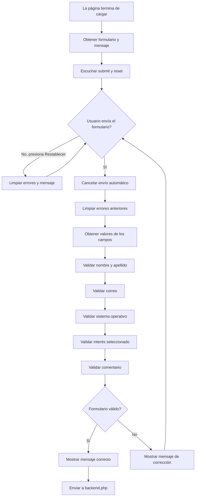
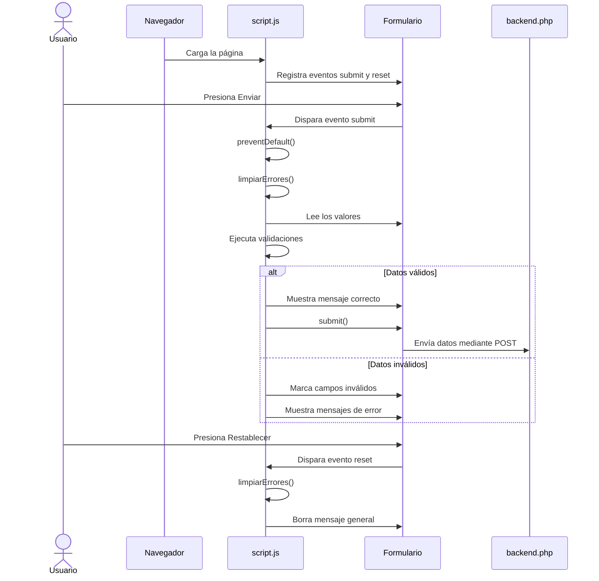
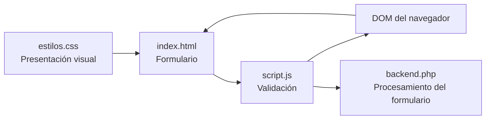

# Documentación de `script.js`

## 1. Objetivo

El archivo `script.js` controla la validación del formulario de opinión antes de enviarlo al archivo `backend.php`.

Sus responsabilidades principales son:

- Esperar a que la página termine de cargar.
- Obtener los elementos del formulario.
- Interceptar el envío del formulario.
- Validar los campos obligatorios.
- Mostrar mensajes de error junto a los campos inválidos.
- Limpiar los errores anteriores.
- Enviar los datos únicamente cuando todas las validaciones son correctas.
- Restablecer los mensajes cuando se utiliza el botón **Restablecer**.

## 2. Inicio del script

```javascript
window.onload = function () {
```

`window.onload` ejecuta una función cuando el documento HTML terminó de cargarse. Esto permite que JavaScript encuentre correctamente los elementos del formulario antes de intentar utilizarlos.

Dentro de esta función se obtienen referencias a los elementos principales:

```javascript
const formulario = document.getElementById("formulario");
const mensaje = document.getElementById("mensaje");
```

- `document.getElementById("formulario")` busca el formulario cuyo `id` es `formulario`.
- `document.getElementById("mensaje")` busca el párrafo donde se muestran mensajes generales.
- `const` crea referencias que no serán reasignadas durante la ejecución.

## 3. Evento de envío

El script escucha el evento `submit` del formulario:

```javascript
formulario.addEventListener("submit", function (evento) {
```

`addEventListener` registra una función que se ejecutará cuando el usuario presione el botón **Enviar formulario**.

### 3.1. Cancelación del envío automático

```javascript
evento.preventDefault();
```

Esta instrucción evita que el navegador envíe inmediatamente el formulario. Primero se ejecutan todas las validaciones de JavaScript.

Luego se limpian los errores anteriores:

```javascript
limpiarErrores();
```

Esto permite que cada intento de envío empiece sin mensajes ni estilos de error viejos.

## 4. Obtención de los campos

El script obtiene los campos mediante sus identificadores HTML:

```javascript
const apellido = document.getElementById("apellido");
const nombre = document.getElementById("nombre");
const email = document.getElementById("email");
const sistema = document.getElementById("sistema");
const comentario = document.getElementById("comentario");
```

También busca el radio button seleccionado:

```javascript
const interes = document.querySelector('input[name="interes"]:checked');
```

El selector `:checked` hace que la variable contenga únicamente la opción seleccionada. Si no se seleccionó ninguna, su valor será `null`.

La expresión regular del correo es:

```javascript
const emailValido = /^[^\s@]+@[^\s@]+\.[^\s@]+$/;
```

Comprueba una estructura básica con texto antes y después de `@`, y un dominio después de un punto.

Finalmente, se crea una variable de control:

```javascript
let formularioValido = true;
```

El formulario comienza considerándose válido. Si alguna comprobación falla, la variable cambia a `false`.

## 5. Validaciones

### Nombre y apellido

```javascript
if (apellido.value.trim() === "") {
    mostrarError(apellido, "Ingresá tu apellido.");
    formularioValido = false;
}
```

`value` obtiene el contenido escrito por el usuario y `trim()` elimina espacios al principio y al final. Si el resultado es vacío, se muestra un error.

El nombre utiliza la misma lógica.

### Correo electrónico

El correo se valida en dos pasos:

1. Se comprueba que no esté vacío.
2. Se comprueba que tenga un formato válido mediante `emailValido.test(...)`.

```javascript
if (email.value.trim() === "") {
    mostrarError(email, "Ingresá tu correo electrónico.");
    formularioValido = false;
} else if (!emailValido.test(email.value.trim())) {
    mostrarError(email, "Ingresá un correo electrónico válido.");
    formularioValido = false;
}
```

### Sistema operativo

```javascript
if (sistema.value === "") {
    mostrarError(sistema, "Seleccioná un sistema operativo.");
    formularioValido = false;
}
```

El valor vacío corresponde a la opción inicial `Seleccioná una opción` del elemento `select`.

### Interés

```javascript
if (!interes) {
    document.getElementById("error-interes").textContent = "Elegí una opción.";
    formularioValido = false;
}
```

Si no existe ningún radio button seleccionado, se escribe el mensaje en el elemento `error-interes`.

### Comentario

El comentario se valida igual que el nombre y el apellido: se eliminan los espacios externos y se comprueba que quede contenido.

## 6. Resultado de la validación

Cuando todas las comprobaciones son correctas, `formularioValido` conserva el valor `true`:

```javascript
if (formularioValido) {
    mensaje.className = "mensaje correcto";
    mensaje.textContent = "Datos correctos. Enviando formulario...";
    formulario.submit();
}
```

En este caso:

- Se agrega la clase CSS `correcto`.
- Se informa que los datos son válidos.
- `formulario.submit()` envía el formulario a `backend.php` mediante el método indicado en HTML, que es `POST`.

Si alguna validación falló, se muestra:

```javascript
mensaje.textContent = "Revisá los campos marcados antes de enviar.";
```

El formulario no se envía y el usuario puede corregir los campos señalados.

## 7. Evento de restablecimiento

```javascript
formulario.addEventListener("reset", function () {
    limpiarErrores();
    mensaje.textContent = "";
});
```

Cuando el usuario presiona **Restablecer**:

1. Se eliminan los mensajes de error.
2. Se quitan las clases visuales de los campos inválidos.
3. Se borra el mensaje general del formulario.

El restablecimiento de los valores de los controles lo realiza automáticamente el navegador debido a que el botón es de tipo `reset`.

## 8. Función `mostrarError`

```javascript
function mostrarError(campo, texto) {
    campo.classList.add("invalido");
    document.getElementById("error-" + campo.id).textContent = texto;
}
```

Esta función recibe:

- `campo`: el elemento que contiene el dato inválido.
- `texto`: el mensaje que se debe mostrar.

`classList.add("invalido")` agrega una clase CSS al campo. Después se busca el mensaje asociado concatenando `error-` con el `id` del campo. Por ejemplo:

```text
id del campo: comentario
id del mensaje: error-comentario
```

## 9. Función `limpiarErrores`

```javascript
function limpiarErrores() {
    document.querySelectorAll(".error").forEach(function (elemento) {
        elemento.textContent = "";
    });

    document.querySelectorAll(".invalido").forEach(function (elemento) {
        elemento.classList.remove("invalido");
    });
}
```

La función realiza dos recorridos:

1. Busca todos los elementos con la clase `.error` y borra su contenido.
2. Busca todos los elementos con la clase `.invalido` y elimina esa clase.

`forEach` ejecuta una función para cada elemento encontrado.

## 10. Elementos HTML relacionados

| Elemento | Identificador o selector | Uso en el script |
|---|---|---|
| Formulario | `#formulario` | Escuchar `submit` y `reset`; enviar datos. |
| Nombre | `#nombre` | Validar que no esté vacío. |
| Apellido | `#apellido` | Validar que no esté vacío. |
| Correo | `#email` | Validar existencia y formato. |
| Sistema operativo | `#sistema` | Validar que se elija una opción. |
| Interés | `input[name="interes"]:checked` | Comprobar que se elija un radio button. |
| Comentario | `#comentario` | Validar que no esté vacío. |
| Mensajes individuales | `.error` | Mostrar errores junto a cada campo. |
| Mensaje general | `#mensaje` | Informar el resultado de la validación. |
| Campos inválidos | `.invalido` | Aplicar y quitar el estilo de error. |

La casilla `#experiencia` existe en el HTML, pero este script no la valida porque es opcional.

## 11. Diagrama UML de actividad



## 12. Diagrama UML de secuencia



## 13. Diagrama UML de componentes



## 14. Observación importante

La validación realizada en JavaScript mejora la experiencia del usuario, pero no debe considerarse una medida de seguridad suficiente. El archivo `backend.php` también debe validar y limpiar los datos recibidos, porque cualquier usuario puede desactivar JavaScript o enviar una petición directamente al servidor.